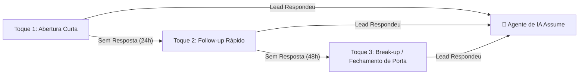

# ❄️ Guia de Abordagem para Leads Frios (Outbound via WhatsApp)

> **Objetivo:** Iniciar conversas no WhatsApp com pessoas que ainda não te conhecem (leads frios), garantindo **alta taxa de resposta**, **zero bloqueios** e transição perfeita para o **Agente de IA**.

---

## 🎯 As 4 Regras de Ouro para Abordar Leads Frios

1. **O objetivo da 1ª mensagem NÃO é vender:** O único objetivo do Toque 1 é fazer o lead **responder a mensagem**. Assim que ele responde qualquer coisa ("Sim", "Quem é?", "Como assim?"), o WhatsApp entende que há engajamento e o **Agente de IA assume a conversa**.
2. **Use Spintax Obrigatório `{opção1|opção2}`:** No OpenWA, o motor de cadência suporta Spintax. Isso altera as palavras de cada mensagem enviada, evitando detecção de spam pelo WhatsApp.
3. **Frases Curtas (Aparecem no Preview):** O lead decide se abre a mensagem lendo a notificação na tela bloqueada do celular. Mensagens de 2 a 3 linhas têm taxa de abertura 4x maior.
4. **Termine com uma Pergunta Aberta e Leve:** Dê um motivo claro e fácil para ele responder.

---

## 📜 Modelos Práticos de Primeiro Toque (Prontos para o OpenWA)

### 🔹 Modelo 1: Confirmação de Cargo/Responsável (Maior Taxa de Resposta 🔥)
> **Por que funciona:** Gera curiosidade e é fácil de responder com apenas "Sim" ou "Sou eu".
```text
{Oi|Opa|Olá}, {nome}! Tudo bem com você?

Você é a pessoa responsável pela área comercial aí na {empresa}?
```

---

### 🔹 Modelo 2: Pergunta Direta sobre a Dor (Ideal para B2B)
> **Por que funciona:** Toca diretamente no problema sem parecer propaganda.
```text
{Opa|Oi|Fala}, {nome}! Tudo certo?

Vi que você trabalha com {setor}. Como vocês estão lidando com a gestão de atendimentos no WhatsApp hoje aí?
```

---

### 🔹 Modelo 3: Abordagem de Oportunidade / Curiosidade
> **Por que funciona:** Apresenta um benefício claro em 1 frase e pede permissão para conversar.
```text
{Oi|Opa}, {nome}, tudo bem?

A gente ajuda empresas de {setor} a {beneficio_curto} sem precisar de {dor_comum}. 

Vale a pena 2 minutos de conversa sobre isso aí com você?
```

---

### 🔹 Modelo 4: Contexto de Perfil (LinkedIn / Redes Sociais)
> **Por que funciona:** Dá um motivo humanizado sobre como você encontrou o contato dele.
```text
{Opa|Oi}, {nome}! Vi seu perfil e achei muito bacana o trabalho de vocês.

Vocês já automatizam o acompanhamento de leads por aí ou o time faz tudo no manual?
```

---

## 🔄 Fluxo de Cadência de 3 Toques (Se o Lead não responder)

Se o lead frio não responder no Toque 1, a régua automática do OpenWA dispara os próximos toques:



- **Toque 1 (Dia 1):** Abordagem curta (usar um dos modelos acima).
- **Toque 2 (24 horas depois):** 
  > `{Oi|Opa}, {nome}! Conseguiu dar uma olhada na mensagem de ontem?`
- **Toque 3 (48 horas depois - Break-up suave):**
  > `{nome}, sei que a correria tá grande por aí. Se não for o momento de falar sobre isso agora, me avisa que não te incomodo mais, tá bom?`

---

## ⚡ O Que Acontece Quando o Lead Frio Responde?

1. O **OpenWA detecta a resposta** do lead.
2. A **Cadência é pausada automaticamente** para aquele número.
3. O **Agente de IA assume imediatamente**, utilizando o **System Prompt Humanizado** que configuramos, conduzindo o atendimento até o agendamento ou fechamento.
