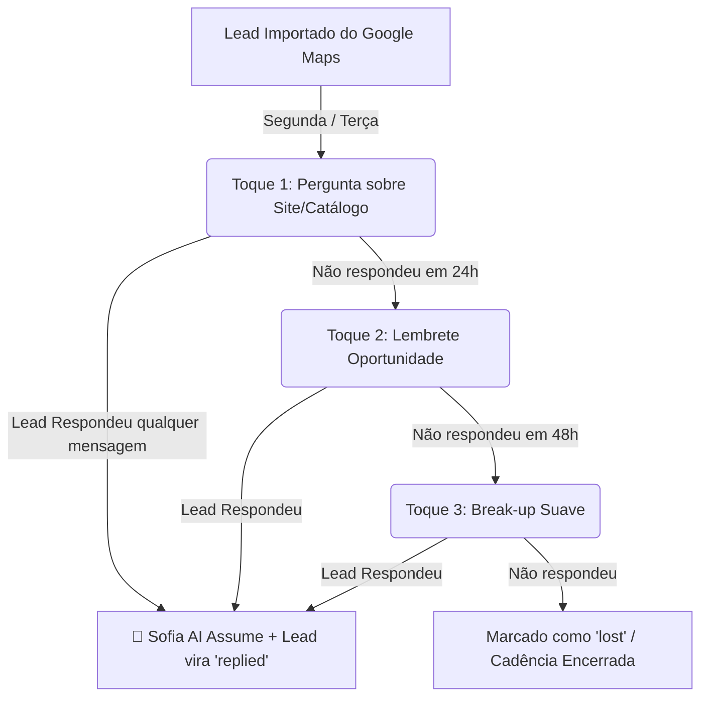

# 📅 Calendário Comercial de Prospecção & Cadência de Leads (OpenWA)

> **Objetivo:** Estrutura operacional semanal de prospecção outbound via WhatsApp para vendas de sites e soluções de atendimento, integrada à Sofia AI e protegida com diretrizes anti-ban.

---

## 🛡️ Diretrizes de Segurança & Regras de Ouro
1. **Volume Diário Seguro:** Máximo de **30 a 40 disparos/dia**, fracionados em **3 lotes** (Manhã, Tarde 1, Tarde 2).
2. **Descanso da Linha:** Pausa total entre **11:30 e 13:30** (preserva a integridade e reputação do chip).
3. **Proteção Spintax:** Uso obrigatório de `{variação1|variação2}` em todas as mensagens para alterar o texto por envio.
4. **Aprovação Prévia:** De acordo com as regras do projeto (`AGENTS.md`), nenhum lote é enviado sem apresentação prévia dos contatos e textos em tela e confirmação do usuário.
5. **Transição Automática (Sofia AI):** Assim que o lead responde qualquer mensagem, a cadência é cancelada automaticamente (`status = replied`) e o Agente de IA assume a conversa.

---

## 📅 Grade Semanal do Calendário Comercial

| Dia da Semana | Bloco 1 (08:30 - 11:30) | Pausa (11:30 - 13:30) | Bloco 2 (13:30 - 16:30) | Bloco 3 (16:30 - 19:30) | Meta do Dia |
| :--- | :--- | :---: | :--- | :--- | :---: |
| **Segunda-feira** | **Reativação & Lote 1**<br>• 15 novos leads (Toque 1)<br>• Checagem dos serviços | ☕ Pausa da Linha | **Lote 2 (Novos Leads)**<br>• 15 novos leads (Toque 1)<br>• Atendimento Sofia AI | **Follow-ups & Resgate**<br>• Resgate de conversas abertas na semana anterior | 30 leads impactados |
| **Terça-feira** | **Follow-ups + Lote 1**<br>• **Toque 2 (24h)** dos leads de Segunda<br>• 10 novos leads (Toque 1) | ☕ Pausa da Linha | **Lote 2 (Novos Leads)**<br>• 15 novos leads (Toque 1)<br>• Qualificação via Sofia AI | **Análise de Respostas**<br>• Organizar leads quentes no Kanban (`replied` / `proposal`) | ~35 toques executados |
| **Quarta-feira** | **Follow-ups + Lote 1**<br>• **Toque 2 (24h)** dos leads de Terça<br>• **Toque 3 (Break-up 48h)** de Segunda<br>• 10 novos leads | ☕ Pausa da Linha | **Lote 2 (Novos Leads)**<br>• 15 novos leads (Toque 1)<br>• Envio de propostas de sites | **Hot Leads Focus**<br>• Negociação direta com interessados em site/catálogo | ~35 toques executados |
| **Quinta-feira** | **Follow-ups + Lote 1**<br>• **Toque 2 (24h)** dos leads de Quarta<br>• **Toque 3 (48h)** de Terça<br>• 10 novos leads | ☕ Pausa da Linha | **Foco em Fechamento**<br>• Atendimento intensivo Sofia AI<br>• Apresentação de layouts de demonstração | **Propostas Comerciais**<br>• Envio de links de orçamentos e agendamento de reuniões | 5 propostas ativas |
| **Sexta-feira** | **Follow-ups Finais**<br>• **Toque 3 (Break-up 48h)** de Quarta<br>• Reciclagem de leads sem resposta | ☕ Pausa da Linha | **Consolidação & Relatório**<br>• Rodar `node scripts/sync-obsidian.js`<br>• Limpeza de base | **Planejamento Semanal**<br>• Enriquecer lista de leads (Google Maps / Apify) para próxima semana | Balanço da semana |

---

## 🔄 Fluxo de Cadência de 3 Toques



---

## 📜 Modelos de Copies para Cadência (Prontos para Spintax)

### 📍 Toque 1: Abertura Consultiva (Envio Inicial)
> **Objetivo:** Gerar engajamento imediato e fazer o lead responder (com "Sim", "Não" ou "Quem é?").

```text
{Oi|Opa|Olá}, {nome}! Tudo bem?

Pesquisei por empresas de {setor|categoria} aqui em {cidade} no Google e vi o perfil de vocês.

Vocês já têm um site ou catálogo online atualizado pra mandar pros clientes, ou atendem só direto no WhatsApp?
```

### 📍 Toque 2: Follow-up de 24 Horas (Lembrete Rápido)
> **Objetivo:** Lembrar o lead da mensagem anterior sem ser invasivo.

```text
{Oi|Opa}, {nome}! Tudo certo?

Conseguiu dar uma olhada na mensagem anterior? Estamos desenvolvendo algumas páginas de alta conversão para empresas aqui da região essa semana e lembrei de vocês.
```

### 📍 Toque 3: Break-up de 48 Horas (Fechamento de Porta Suave)
> **Objetivo:** Provocar resposta por medo de perder a oportunidade.

```text
{nome}, imagino que a rotina aí seja bem corrida!

Se não for o momento de criar ou atualizar o site de vocês agora, me avisa pra eu não te incomodar mais por aqui, tá bom?
```

---

## 📊 Métricas & Metas de Desempenho
- 🎯 **Novos Leads Contactados:** ~100 a 120 empresas locais / semana.
- 💬 **Taxa de Engajamento Esperada:** 15% a 25% de respostas.
- 📝 **Propostas Comercializadas:** 4 a 8 propostas de sites/catálogos por semana.
- 💰 **Fechamentos:** 1 a 3 novos clientes recorrentes por semana.
