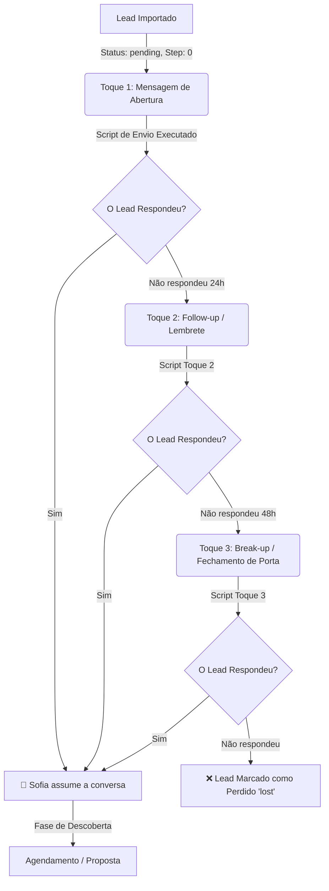

# 🔄 Fluxo Lógico de Follow-Ups (Cadência Automática)

> **Objetivo:** Documentar o funil de mensagens de prospecção para que tanto o usuário quanto os Agentes de IA entendam exatamente em qual etapa cada lead está e como a automação funciona.

---

## 🧭 Diagrama de Funil (Mermaid)

---

## 📊 Como o Banco de Dados (Supabase) rastreia isso?

Cada contato possui dois campos fundamentais no Supabase para gerenciar a cadência: `status` e `current_step`.

### 1️⃣ Etapa Zero (Fila Fria)
- **Status no Banco:** `pending`
- **Step no Banco:** `0`
- **O que acontece:** O lead acabou de vir do Google Maps (Apify). Ele está na fila aguardando o primeiro disparo manual ou em lote.

### 2️⃣ Toque 1 (Abertura Consultiva)
- **Status no Banco:** `contacted`
- **Step no Banco:** `1`
- **Ação:** O script envia a mensagem de abertura (ex: *"Vocês têm site ou usam só o Whats?"*).
- **Espera:** Aguardamos até 24 horas. Se o lead não responder, ele se qualifica para o Toque 2.

### 3️⃣ Toque 2 (Follow-up de 24h)
- **Status no Banco:** `contacted`
- **Step no Banco:** `2`
- **Ação:** O script `send-followup-toque2.js` filtra quem está no Step 1 e manda o lembrete (ex: *"Conseguiu ver a mensagem anterior?"*).
- **Espera:** Aguardamos mais 24 a 48 horas. Se o lead seguir ignorando, ele vai para o Toque final.

### 4️⃣ Toque 3 (Break-up)
- **Status no Banco:** `lost` (Se não responder) ou `contacted` com `Step: 3`.
- **Ação:** O script `send-followup-toque3.js` manda a última cartada (*"Se não for o momento, não te incomodo mais"*). Se ele responder a isso, a Sofia tenta reverter. Se não responder, a cadência é oficialmente encerrada para não levar ban no WhatsApp.

---

## 🤖 Intervenção da Sofia (IA)

O pulo do gato é: **Assim que o lead manda QUALQUER mensagem de volta, a cadência fria é imediatamente CANCELADA para ele.**

- A Sofia (nosso agente IA configurado no `ai-agent.service.ts`) entra em ação.
- O campo `status` do lead no banco de dados muda automaticamente para `replied`.
- Ele para de receber os disparos automáticos (Toque 2 e 3) e o atendimento passa a ser 100% humanizado através da IA.
