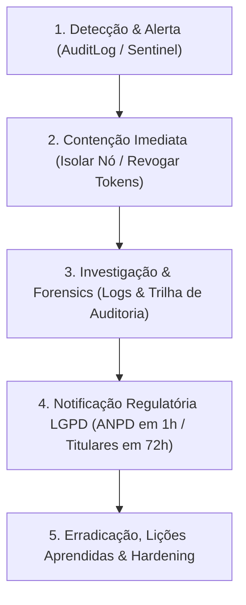

# 🚨 Playbook de Resposta a Incidentes de Segurança & LGPD Art. 48

Este playbook define os procedimentos operacionais padrão (SOP) para identificação, contenção, erradicação e notificação de incidentes de segurança e possíveis vazamentos de dados pessoais.

---

## 1. Matriz de Gravidade e Prazos Regulatórios

| Nível de Severidade | Descrição do Incidente | Ação de Contenção | Prazos de Notificação |
| :--- | :--- | :--- | :--- |
| 🔴 **CRÍTICO** | Acesso não autorizado a banco de dados, vazamento de PII ou roubo de chaves API/sessão. | Isolar nó/banco, revogar tokens, rotacionar chave mestra. | **ANPD**: 1 hora<br>**Titulares / Clientes**: < 72 horas |
| 🟠 **ALTO** | Falha de autenticação repetida, DoS no Gateway ou suspeita de abuso em chip. | Pausar sessão do chip, ativar rate limit e capturar logs. | **Equipe Interna**: 15 minutos |
| 🟡 **MÉDIO** | Erro de integração com webhook ou blip temporário no Redis. | Reconciliação automatizada de filas. | **Equipe Interna**: 4 horas |

---

## 2. Fluxo de Resposta a Incidentes em 5 Passos



---

## 3. Protocolo de Notificação Regulatória LGPD Art. 48

### Passo 3.1: Notificação à ANPD (Prazo de 1 hora após confirmação)
Enviar comunicação oficial para o canal da ANPD com o relatório gerado por `lgpdComplianceService.initiateBreachProtocol()` contendo:
* Natureza e dados pessoais afetados.
* Informações sobre os titulares envolvidos.
* Medidas de segurança técnicas adotadas antes e depois do incidente.
* Riscos relacionados ao incidente e medidas de mitigação.

### Passo 3.2: Notificação aos Titulares de Dados (Prazo máximo de 72 horas)
Enviar e-mail / mensagem oficial de alerta contendo:
```text
ASSUNTO: Notificação Importante de Segurança da Informação - LGPD Art. 48

Prezado(a) cliente,

Informamos que detectamos um incidente de segurança em nossa infraestrutura em [DATA/HORA].

1. Dados Impactados: [Empresa / Telefone Comercial]
2. Ações de Contenção Tomadas: Nossos sistemas de criptografia AES-256 mitigaram o acesso a senhas e dados bancários.
3. Recomendações: Fique atento a mensagens suspeitas enviadas em nome da empresa.

Em caso de dúvidas, contate nosso Encarregado de Proteção de Dados (DPO) em dpo@openwa.com.br.
```

---

## 4. Checklist de Recuperação e Retorno à Produção
* [ ] Garantir que todas as chaves mestras foram rotacionadas via `reEncryptData()`.
* [ ] Confirmar que os ips e sessões comprometidas foram revogadas no Gateway.
* [ ] Executar o script de teste de integridade: `npx jest src/modules/cadence/__tests__/cadence-routing.spec.ts`.
* [ ] Atualizar o relatório pós-incidente (Post-Mortem).
