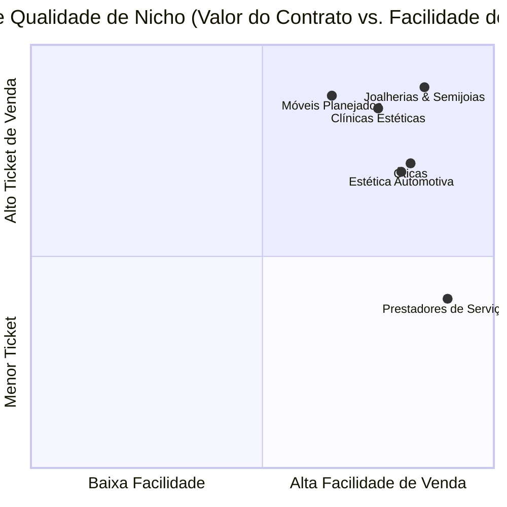

# 🎯 Matriz de ICP (Ideal Customer Profile) - OpenWA + Flowra Labs

> **Objetivo:** Definir os critérios exatos de qualificação, pontuação (ICP Score) e segmentação por nicho para elevar a taxa de conversão das campanhas outbound de vendas de sites e automação WhatsApp.

---

## 📐 1. Critérios Fundamentais do Lead Ideal (ICP Hard Rules)

Para um lead entrar no pipeline prioritário de prospecção, ele deve atender aos seguintes filtros (eliminando "lojas de esquina" ou empresas sem maturidade digital):

| Critério | Filtro Mínimo Recomendado | Por que é importante? |
| :--- | :--- | :--- |
| **Consciência de Marca** | 🏢 Empresa estruturada (Instagram ativo ou marca consolidada) | **Elimina "lojas de esquina"**. O cliente **já sabe** que precisa de presença digital e não precisamos gastar tempo reeducando-o. |
| **Presença Web Gargalo** | ❌ Sem site cadastrado OU site quebrado/não responsivo/link cru | É a dor primária imediata: ele quer/precisa vender online, mas a ferramenta atual é ruim. |
| **Nota Google Maps** | ⭐ **≥ 4.5 estrelas** | Garante que a empresa zela por reputação e atende clientes exigentes. |
| **Volume de Avaliações** | 💬 **≥ 25 avaliações ativas** | Comprova fluxo constante de clientes reais, operação ativa e faturamento saudável. |
| **Localização Geográfica** | Bairros nobres / Polos comerciais consolidados | Maior poder aquisitivo e orçamento liberado sem objeções de preço. |
| **Decisor Acessível** | Proprietário, Sócio, Gerente Comercial | Menos camadas de recepção/atendimento ("gatekeeper"). |

---

## 🏆 2. Matriz de Nichos Alvo por Nível de Ticket & Atratividade



### Tier 1: Nichos Sem Gatekeeper & High-Ticket (Decisor Direto no WhatsApp)
Clientes com alto ticket de venda onde o WhatsApp é atendido **diretamente pelo proprietário ou sócio**:

1. **💎 Joalherias, Relojoarias & Boutiques de Semijoias**
   - *Decisor:* Proprietário / Designer de Joias.
   - *Argumento:* "Galeria elegante em alta definição para transmitir luxo e fechar vendas no Whats."
2. **📐 Arquitetos, Engenheiros & Escritórios de Arquitetura**
   - *Decisor:* Arquiteto Titular / Engenheiro Sócio.
   - *Argumento:* "Portfólio digital ultrarrápido para enviar nos orçamentos de projetos de R$ 20k+."
3. **❄️ Climatização & Instalação de Ar Condicionado de Alto Padrão (VRF / Multi Split)**
   - *Decisor:* Proprietário da Engenharia de Climatização.
   - *Argumento:* "Apresentação técnica e catálogo de projetos executados para residências de alto padrão."
4. **🏡 Móveis Planejados & Marcenarias Finas**
   - *Decisor:* Marceneiro / Proprietário do Showroom.
   - *Argumento:* "Catálogo digital de ambientes projetados para encantar o cliente no primeiro contato."

---

### 🚫 Nichos Banidos (Bloqueados por Gatekeepers)
- ❌ **Clínicas Médicas / Estéticas**: Bloqueadas por recepcionistas que filtram e descartam contatos de vendas.
- ❌ **Restaurantes / Lanchonetes**: Atendimento caótico por garçons/atendentes de caixa sem autonomia de decisão.

---

## 📊 3. Sistema de Pontuação de Leads (ICP Score: 0 a 100 Pts)

Ao importar novas listas do Google Maps ou Apify, cada lead receberá uma pontuação automática para priorização de envio:

```text
Score Final = Sum(Pontos de Critério)
```

| Critério | Condição | Pontuação |
| :--- | :--- | :---: |
| **Status do Site** | Não possui site oficial cadastrado no Google | **+30 pts** |
| **Nicho do Negócio** | Pertence ao Tier 1 (Joias, Estética, Planejados) | **+25 pts** |
| **Avaliações Google** | ≥ 30 avaliações com nota ≥ 4.5 | **+20 pts** |
| **Localização** | Bairro de alta renda (ex: Itaim Bibi, Moema, Jardins, etc.) | **+15 pts** |
| **WhatsApp Verificado** | Número verificado e ativo no WhatsApp | **+10 pts** |

- **🔥 Lead Prioritário (Score 80-100):** Entra no Lote 1 de prospecção diária.
- **🟡 Lead Secundário (Score 50-79):** Entra nos lotes complementares.
- **⚪ Lead Desqualificado (Score < 50):** Mantido em espera ou descartado.

---

## 💬 4. Modelos de Abordagem Customizados por Nicho (Com Spintax)

### 🔹 Para Clínicas Estéticas / Odontologia Estética
```text
{Oi|Opa|Olá}, {nome}! Tudo bem?

Pesquisei por {clinicas de estetica|harmonizacao} aqui em {cidade} no Google e encontrei a {empresa}.

Vocês já têm uma página online pros pacientes verem os procedimentos e agendarem direto pelo WhatsApp, ou fazem tudo só no atendimento manual?
```

### 🔹 Para Móveis Planejados / Marcenarias
```text
{Oi|Opa|Olá}, {nome}! Tudo certo?

Vi o perfil da {empresa} no Google enquanto pesquisava marcenarias/planejados em {cidade}.

Vocês já possuem um site ou portfólio digital atualizado pra mandar pros clientes quando eles pedem orçamento, ou atendem direto no Whats?
```

### 🔹 Para Óticas & Estética Automotiva
```text
{Oi|Opa}, {nome}! Tudo bem por aí?

Estava olhando as empresas de {setor} aqui da região de {cidade} e vi que a {empresa} tem ótimas avaliações no Google, mas ainda não tem um site oficial cadastrado.

Vocês têm interesse em colocar um site simples e moderno no ar essa semana pra atrair mais clientes aqui da cidade?
```

---

## 🚀 5. Próximos Passos de Execução

1. **Configurar Filtros de Scraping:** Atualizar os parâmetros de busca no `scripts/run-apify-google-maps.js` para buscar os novos nichos do Tier 1 nos melhores bairros de SP/cidades selecionadas.
2. **Atualizar o Script de Importação (`import-apify-leads.js`):** Incluir validação da nota e volume de avaliações do Google Maps para calcular o ICP Score.
3. **Executar a Raspagem de um Novo Lote Qualificado:** Gerar lista de 30 a 50 leads no padrão de alta conversão.
