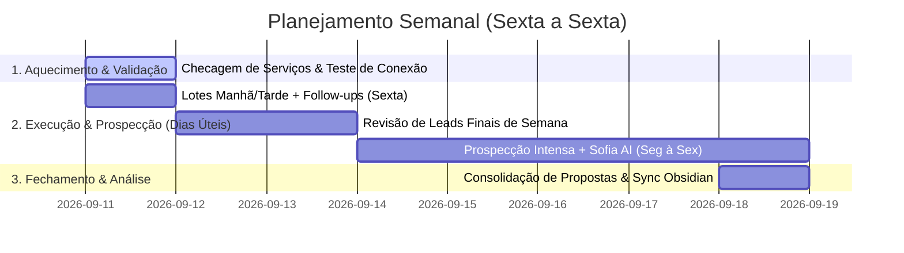

# 🚀 Plano Estratégico de Prospecção & Operação (Sexta a Sexta)

> **Período:** Sexta-feira (11/09) até Sexta-feira (18/09)  
> **Objetivo:** Retomada 100% da Operação OpenWA + Sofia AI com segurança anti-ban, prospecção de novos leads de alto valor (ex: joalherias/relojoarias/locais sem site) e fechamento de propostas de sites/catálogos.

---

## 🛡️ Regra de Ouro (Segurança & Transparência)
1. **Regra de Disparo:** De acordo com as diretrizes do projeto (`AGENTS.md`), **NUNCA** são feitos disparos em lote no WhatsApp sem a apresentação prévia dos leads/textos e aprovação explícita em tela.
2. **Proteção Anti-Ban:** 
   - Máximo de 30 a 40 disparos/dia divididos em **3 lotes** (Manhã, Tarde 1, Tarde 2).
   - Delay dinâmico/humanizado entre 5 e 15 minutos entre cada envio.
   - Respostas da Sofia AI com delay bufferizado de 20s.

---

## 📅 Cronograma Semanal Detalhado



---

### 🟢 Sexta-feira (11/09) — *Reativação e Retomada*
- **Manhã (08:30 - 11:30):** 
  - Verificar backend NestJS (`http://localhost:2785`) e Dashboard (`http://localhost:5173`).
  - Reconectar a sessão do WhatsApp no `/sessions` se necessário.
  - Verificar extensão Sofia AI no WhatsApp Web.
- **Tarde 1 (13:30 - 16:30):**
  - **Lote 1 (Novos Leads / Toque 1):** Apresentar a lista e mensagens em tela para aprovação. Após "OK", executar o Lote 1 (10-15 envios).
- **Tarde 2 (16:30 - 19:30):**
  - **Follow-ups (Toque 2):** Resgatar contatos que ficaram sem resposta antes da pausa de 2 dias.
  - Atendimento e transição para a Sofia AI.

---

### 🟡 Sábado (12/09) e Domingo (13/09) — *Organização de Base*
- **Sábado:** Enriquecer a lista de leads no Obsidian (`LEADS_PROSPECTADOS_OBSIDIAN.md`) buscando novos alvos sem site ou com site desatualizado.
- **Domingo:** Deixar o checklist da semana seguinte refinado e scripts testados localmente.

---

### 🟢 Segunda-Feira (14/09) a Quarta-Feira (16/09) — *Ritmo Máximo de Prospecção*
- **Ritmo Diário (3 Lotes):**
  - **08:30 - 11:30 (Lote 1 Manhã):** Follow-ups dos dias anteriores (Toque 2) + 12 envios novos.
  - **11:30 - 13:30 (Descanso da Linha):** Pausa total de envio (preserva a integridade do chip).
  - **13:30 - 16:30 (Lote 2 Tarde 1):** 12 a 15 envios novos (Com aprovação prévia).
  - **16:30 - 19:30 (Lote 3 Tarde 2):** 10 a 12 envios finais + fechamento manual dos leads que pedirem orçamento de site.

---

### 🔵 Quinta-Feira (17/09) e Sexta-Feira (18/09) — *Acompanhamento Quente & Fechamento*
- **Foco:** Diminuir ligeiramente os novos disparos e focar nos **Leads Quentes** (empresas que responderam à Sofia e estão em fase de negociação de proposta).
- **Consolidação:** Rodar a sincronização dos relatórios no Obsidian:
  ```bash
  node scripts/sync-obsidian.js
  ```
- **Balanço da Semana:** Avaliar taxa de resposta, propostas de sites enviadas e reuniões agendadas.

---

## 📊 Métricas de Meta da Semana
- 🎯 **Novos Leads Impactados:** ~120 a 150 empresas.
- 💬 **Taxa de Engajamento Esperada:** 15% a 25% de respostas.
- 📝 **Propostas de Sites Geradas:** 5 a 10 propostas comerciais.

---
*Plano gerado e alinhado para execução imediata.*
